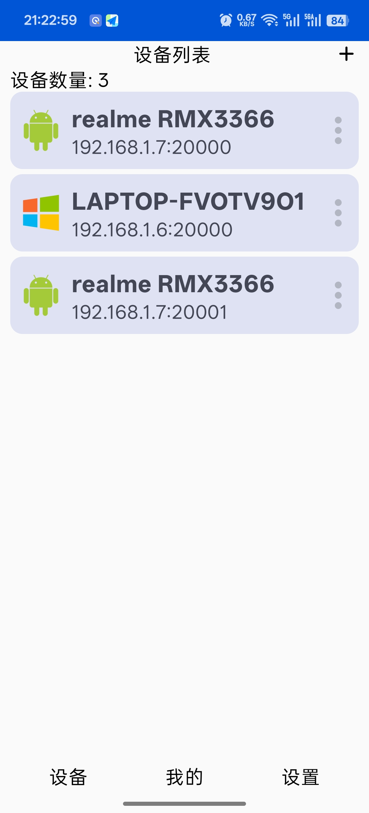
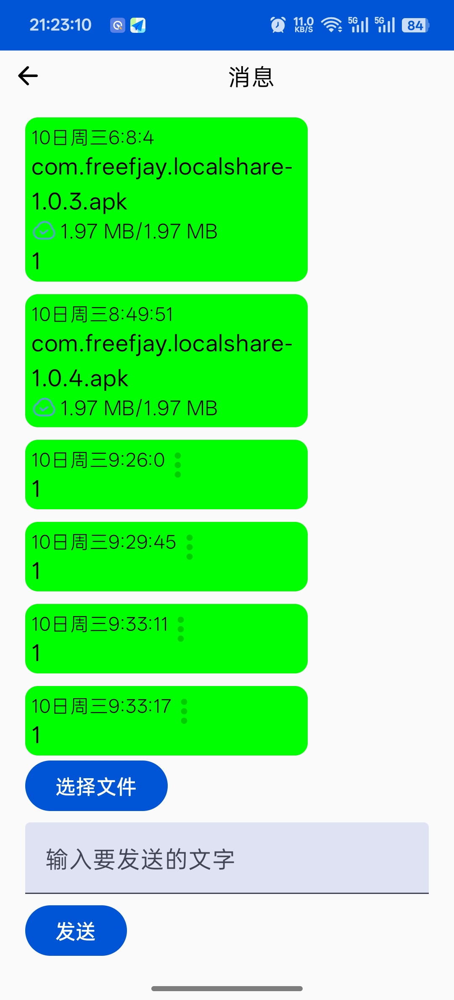

# LocalShare
## 简介
LocalShare是一个基于mDns协议实现的局域网文本文件传输助手。

LocalShare的UI界面模仿了微信界面，使用聊天界面的ui展示用户接收和发送的消息。

LocalShare支持文本、文件的发送(目前仅支持windows和android平台)

## 界面截图

### pc端

### 移动端

## 开发框架
pc端: Jetpack Compose Desktop

移动端: Jetpack Compose

## mDns介绍
mdns 即多播dns（Multicast DNS），mDNS主要实现了在没有传统DNS服务器的情况下使局域网内的主机实现相互发现和通信，使用的端口为5353，遵从dns协议，使用现有的DNS信息结构、名语法和资源记录类型。并且没有指定新的操作代码或响应代码。在局域网中，设备和设备之间相互通信需要知道对方的ip地址的，大多数情况，设备的ip不是静态ip地址，而是通过dhcp协议动态分配的ip 地址，如何设备发现呢，就是要mdns大显身手，例如：现在物联网设备和app之间的通信，要么app通过广播，要么通过组播，发一些特定信息，感兴趣设备应答，实现局域网设备的发现，当然mdns 比这强大。